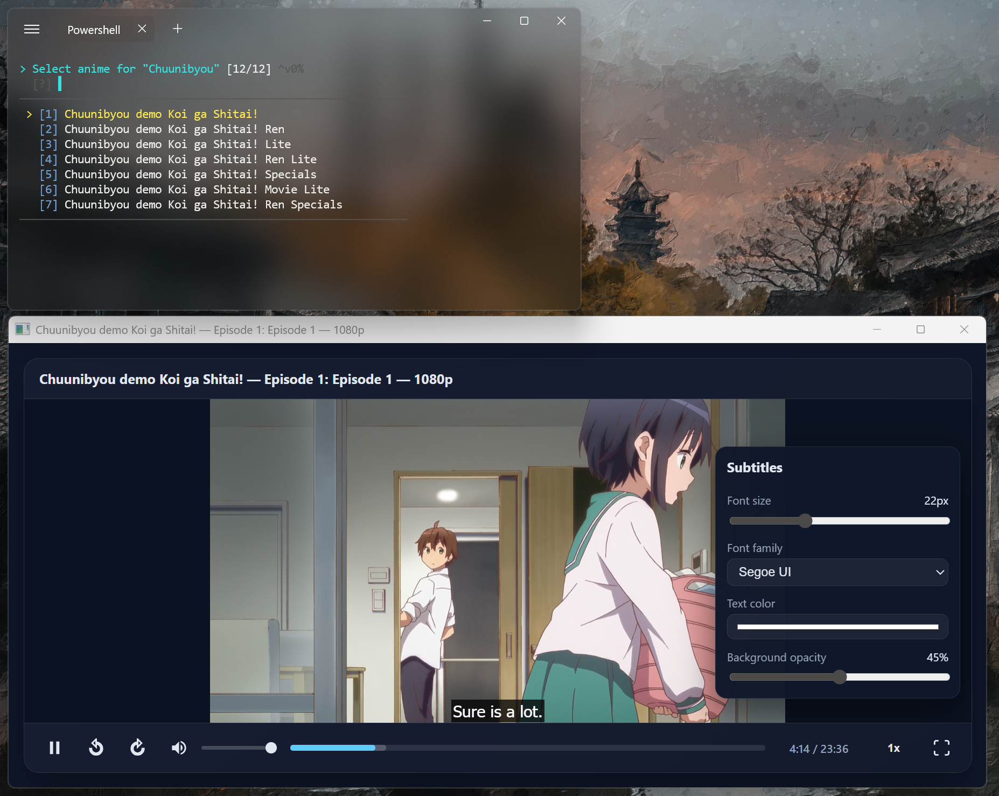

<p align="left">
  
</p>

# Koware

Koware is a **standalone**, console-first link/stream aggregator for **Windows** and **macOS** that helps you search for anime/manga and open streams in a player from your terminal.

It has a text-based user interface but behaves like a regular CLI. You run a command, Koware queries your configured sources, and opens the selected stream in a video player or manga in a reader.

> Koware requires no external dependencies or additional software. Everything—including the TUI components, fuzzy search, and terminal rendering—is built from scratch in pure C#.

> **⚠️ Important:** Koware ships with **no pre-configured sources**. You must configure your own sources before using it. See [Source Configuration](#source-configuration) below.

---

## Demo

<p align="center">
  
</p>

<p align="center">
  
  
</p>

<p align="center">
  <em>Left: Koware Player | Right: Koware Reader</em>
</p>

---

## Features

- **Search for anime/manga** by title
- **Browse episodes/chapters** for a selected show
- **Open streams** in IINA, mpv, VLC, or the bundled Koware player (Windows)
- **Read manga** in the bundled reader (Windows and macOS)
- **Keep watch history** locally in a small SQLite database

Koware does **NOT** host any media. It does **NOT** include any source URLs. It only provides a framework for accessing user-configured sources.

---

## Quickstart (about 5 minutes)

- Install (Windows): `.\install-koware.ps1 -Publish`
- Install (macOS): `./Scripts/publish-macos.sh` then run the app from `publish/`
- Auto-configure providers: `koware provider autoconfig`
- Test connectivity: `koware provider test`
- Search and play: `koware stream "haikyuu" --episode 1 --quality 720p`

After that, fine-tune `appsettings.user.json` if you need custom hosts.

---

## Getting started

### Requirements

- **Windows**: Windows 10 x64 or later, PowerShell.
- **macOS**: macOS 11+ (Intel or Apple Silicon).
- To run from source: **.NET 8 SDK**.

### Install globally from source

1. Clone this repository.
2. From the repo root, run:

```powershell
.# From repo root
 .\install-koware.ps1 -Publish   # builds, publishes, and adds Koware to your PATH
```

This installs Koware under `%LOCALAPPDATA%\koware` and adds a global `koware` command.

After installation, open a new PowerShell window and run, for example:

```powershell
koware search "bleach"
koware watch "haikyuu" --episode 1
```

### Install via the installer (Windows)

The installer package bundles everything needed to run Koware without needing to build from source. You can download the latest installer from the [releases page](https://github.com/S1mplector/Koware/releases). Koware will be added to your CMD and powershell configuration by default.

#### About powershell script execution policy

If typing koware and other koware commands don't work in a powershell prompt, in an administrator powershell prompt, run: 

```Powershell
Set-ExecutionPolicy -Scope CurrentUser -ExecutionPolicy RemoteSigned
```

If you prefer not to, koware will work perfectly fine in any command prompt shell.
### Install on macOS

#### Option 1: DMG Installer
Download the DMG from the [releases page](https://github.com/S1mplector/Koware/releases), open it, and it will run you through the install process. 

#### Option 2: Build from source
```bash
# Clone and navigate to repo
cd Koware

# Make the script executable and run it
chmod +x Scripts/publish-macos.sh
./Scripts/publish-macos.sh

# For Apple Silicon (default)
./Scripts/publish-macos.sh --runtime osx-arm64

# For Intel Macs
./Scripts/publish-macos.sh --runtime osx-x64
```

The script creates a DMG in `publish/` that you can distribute or install from.

### Run without installing globally

From the repo root you can also run Koware directly via `dotnet`:

```powershell
dotnet run --project .\Koware.Cli -- search "<query>"
```

Or use the helper script:

```powershell
cd .\Koware
 .\koware.ps1 -Command search -Query "fullmetal alchemist"
 .\koware.ps1 -Command stream -Query "haikyuu" -Episode 1 -Quality 720p
 .\koware.ps1 -Command play -Query "demon slayer" -Episode 1 -Quality 1080p
```

---

## A few Example Commands 

All examples assume you have the global `koware` command installed. If not, replace `koware` with `dotnet run --project .\Koware.Cli --`.

- **`search`** – find anime by title and select an entry.
  - Example:

    ```powershell
    koware search "one piece"
    ```

- **`stream`** – choose a show, episode, and quality, and open the stream in your configured player.
  - Example:

    ```powershell
    koware stream "haikyuu" --episode 1 --quality 720p
    ```

- **`play`** – convenience command that searches and immediately opens a specific episode at a given quality.
  - Example:

    ```powershell
    koware play "demon slayer" --episode 1 --quality 1080p
    ```

- **`history`** – inspect and manage your local watch history.
  - Run:

    ```powershell
    koware help history
    ```

When multiple search results are found, Koware will prompt you to choose one. You can also pass `--index <n>` or `--non-interactive` to skip prompts (useful for scripting).

Stream selection prefers HLS/DASH and HTTPS hosts; noisy HTTP logging is filtered by default so you can focus on the important bits.

For more information about available commands and options, run:

```powershell
koware help
``` 
---

## Configuration

Koware reads its configuration from `Koware.Cli/appsettings.json`. This file is copied to the output directory at build time and read at runtime.

Key settings:

- **Player**
  - By default, Koware uses the **bundled Koware player** for best compatibility. The player is included in the installer package. It's a lightweight, cross-platform media player built for Koware, and it's designed to work seamlessly with Koware's streaming workflow.
  - You can switch to **VLC** or **mpv** (or any other player) by changing:
    - `Player:Command` – the path or command name for your player.
    - `Player:Args` – arguments that Koware should pass to the player.

    Or, alternatively by using the config command. For more info, do:
    `koware help config`

- **Reader** 
  - Koware is installed bundled with the Koware reader. It is recommended to use the bundled reader, as other manga readers haven't been tested yet and compatibility is not guaranteed.

---

## Source Configuration

**Koware ships with no pre-configured sources.** You must configure sources yourself before using the app.

### Where to put your config

Create or edit the configuration file at:

- **Windows**: `%APPDATA%\koware\appsettings.user.json`
- **macOS/Linux**: `~/.config/koware/appsettings.user.json`

Start from the sample in the repo:

```bash
cp Koware.Cli/appsettings.json ~/.config/koware/appsettings.user.json
```

Then edit the copy with your own host/API URLs.

### Auto-configure providers (recommended)

Koware can pull working provider configs from the public `koware-providers` repo and merge them into your `appsettings.user.json`:

```bash
koware provider autoconfig            # configure all available providers
koware provider autoconfig --list     # see what’s available
koware provider autoconfig allanime   # configure a single provider
koware provider test                  # verify connectivity
```

The command fetches `providers.json` plus the referenced config files, merges them into your config, and keeps any custom fields you already have. If the request fails, you can still edit manually as described below.

### Example Configuration

```json
{
  "AllAnime": {
    "Enabled": true,
    "BaseHost": "your-source-host.example",
    "ApiBase": "https://api.your-source.example",
    "Referer": "https://your-source.example",
    "TranslationType": "sub"
  },
  "AllManga": {
    "Enabled": true,
    "BaseHost": "your-manga-host.example",
    "ApiBase": "https://api.your-manga-source.example",
    "Referer": "https://your-manga-source.example",
    "TranslationType": "sub"
  },
  "GogoAnime": {
    "Enabled": false,
    "ApiBase": "https://api.your-alt-source.example",
    "SiteBase": "https://your-alt-source.example"
  }
}
```

### What each field means

| Field | Purpose | Notes |
|-------|---------|-------|
| `Enabled` | Turns the source on/off | Set `true` only for sources you control/trust |
| `BaseHost` | Host name used to build detail/cover image links | Example: `allanime.to` |
| `ApiBase` | Base URL for GraphQL/REST calls | Example: `https://api.allanime.to` |
| `Referer` | Referer/Origin headers | Should match the site you’re calling |
| `TranslationType` | sub/dub/etc. when the API supports it | `sub` is common |
| `SearchLimit` (if present) | Max results per query | Lower it if your source rate-limits |

**Per source**

- `AllAnime` / `AllManga`: Require `BaseHost`, `ApiBase`, `Referer`, and `TranslationType`.
- `GogoAnime`: Uses `SiteBase` for page URLs and `ApiBase` for API calls.

### Finding Sources

Koware does not provide or recommend specific sources. You must:

1. Find compatible API endpoints yourself
2. Ensure you have the legal right to access them
3. Configure them in your `appsettings.user.json`

**Note:** Without configured sources, Koware will display a warning and return no results.

### Quick sanity checks

- Run `koware search "<title>"` to confirm you get results; an empty list usually means `ApiBase`/`Referer`/`BaseHost` is incorrect.
- Logs will warn if a source is disabled or missing required fields.
- If you rotate hosts often, keep multiple sources in the file and flip `Enabled` as needed.

### Provider commands cheat sheet

| Command | What it does |
|---------|--------------|
| `koware provider list` | Show providers and enabled/disabled state |
| `koware provider autoconfig [name]` | Pull remote config for all or a specific provider |
| `koware provider autoconfig --list` | Show which remote providers are available |
| `koware provider test [name]` | Quick connectivity check |
| `koware provider --enable <name>` / `--disable <name>` | Toggle a provider |
| `koware provider add <name>` | Interactive manual setup |
| `koware provider edit` | Open your config in the default editor |

### Troubleshooting

- **No results / empty search**: Run `koware provider test`, confirm `ApiBase` and `Referer` are valid, and re-run `koware provider autoconfig`.
- **HTTP 403/401**: The source likely requires a specific `Referer`/`Origin`—ensure they match the site host.
- **Bad host errors**: `BaseHost` must be a hostname only (no protocol). `ApiBase` must be a full URL.
- **Resetting**: Move/delete `appsettings.user.json`, copy `Koware.Cli/appsettings.json`, then run `koware provider autoconfig`.

---

## Technical Highlights

### Custom fzf-Style Selector

Koware includes a custom-built interactive selector inspired by [fzf](https://github.com/junegunn/fzf), implemented entirely from scratch in C# with no external TUI libraries.

**Architecture (Single Responsibility Principle):**

| Component | File | Responsibility |
|-----------|------|----------------|
| `InteractiveSelector<T>` | `InteractiveSelector.cs` | Orchestrates selection flow, manages state |
| `TerminalBuffer` | `TerminalBuffer.cs` | Low-level terminal I/O, ANSI escape codes, double-buffering |
| `SelectorRenderer` | `SelectorRenderer.cs` | UI rendering logic |
| `InputHandler` | `InputHandler.cs` | Keyboard input processing |
| `FuzzyMatcher` | `FuzzyMatcher.cs` | Fuzzy string matching algorithm |

**Features:**
- **Double-buffered rendering** – Builds output in a buffer before flushing to prevent flicker
- **Alternate screen buffer** – Uses ANSI `\x1b[?1049h` for a clean, full-screen TUI experience
- **Terminal resize handling** – Detects terminal size changes and re-renders automatically
- **Fuzzy search** – Type to filter items with intelligent scoring (exact matches, word boundaries, consecutive characters)
- **Quick jump** – Press 1-9 to instantly select visible items
- **Vim-style navigation** – Arrow keys, Page Up/Down, Home/End support

**Why build from scratch?**
- Zero external dependencies keeps Koware lightweight and portable
- Full control over rendering behavior and ANSI escape sequences
- Optimized for the specific use case of selecting anime/manga entries
- Cross-platform compatibility (Windows, macOS) without platform-specific TUI libraries

---

## Watch history

Koware keeps a local watch history in a small SQLite database:

- **Windows**: `%APPDATA%\koware\history.db`
- **macOS**: `~/.config/koware/history.db`

To learn more and see available history options, run:

```powershell
koware help history
```

## Usage & Legality

### No Bundled Sources

**Koware ships with zero pre-configured sources.** The software is a framework that requires users to configure their own sources. This is similar to how a web browser does not include bookmarks—users add their own.

### What Koware Does NOT Do

- ❌ Does NOT host, store, or distribute any media content
- ❌ Does NOT include any pre-configured source URLs or streaming links
- ❌ Does NOT include or support bypassing paywalls or DRM
- ❌ Does NOT circumvent technical protection measures

### User Responsibility

You are solely responsible for:

1. The sources you configure
2. The content you access
3. Ensuring compliance with your local laws
4. Respecting the terms of service of any services you access

**Koware does not turn unauthorized or infringing content into authorized content.**

### Legal Documents

- See [`Usage-Notice.md`](Usage-Notice.md) for the full usage notice
- See [`DMCA.md`](DMCA.md) for our DMCA policy and takedown process

*Nothing in this project, its documentation, or its source code constitutes legal advice.*
